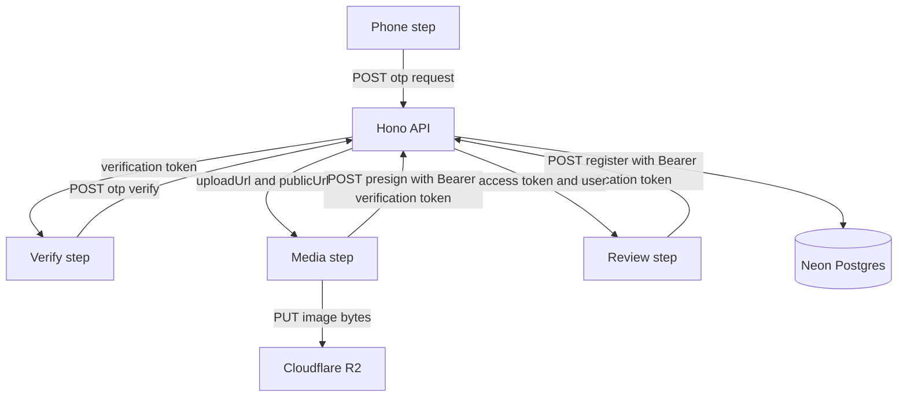

# Taka Resident — Node Server Plan (`taka-server-resident`)

Server repo: `C:\Users\eddie\OneDrive\Documents\Web Projects\taka-server-resident` (greenfield, no files yet).
Consumer app: `C:\Users\eddie\OneDrive\Documents\Web Projects\taka-app-resident` (Expo Router, TypeScript).
Companion AI service: `C:\Users\eddie\OneDrive\Documents\Web Projects\taka-ai` (Python, Koyeb) — deferred, out of scope for this plan.

## 1. Goal

Build the backend that makes the `taka-app-resident` sign-up flow work end to end, deployable to Vercel as a serverless API, backed by Neon Postgres via Prisma, with Zod-validated requests and Cloudflare R2 for image uploads.

Immediate deliverable: the six endpoints the app already calls, running locally on port `3000` (the app's default `EXPO_PUBLIC_API_URL`) and passing end-to-end sign-up for all three account intents.

## 2. Confirmed decisions

| Decision | Choice |
| --- | --- |
| Language / runtime | TypeScript on Node.js LTS |
| Web framework | Hono |
| Deployment | Vercel serverless functions |
| Database | Neon Postgres |
| ORM | Prisma |
| Validation | Zod |
| Package manager | pnpm |
| OTP delivery (Dev/Preview) | Dev stub behind a provider adapter; no external SMS yet |
| Image storage | Cloudflare R2 via S3-compatible presigned PUT |

## 3. Client contract — source of truth

Derived from the app's API layer; these paths and shapes must not drift.

- Base URL: `EXPO_PUBLIC_API_URL`, default `http://localhost:3000` — see [`client.ts`](../../taka-app-resident/src/api/client.ts:9).
- Auth calls: [`auth.ts`](../../taka-app-resident/src/api/auth.ts:29).
- Upload calls: [`uploads.ts`](../../taka-app-resident/src/api/uploads.ts:22).
- Payload schemas to mirror: [`schemas.ts`](../../taka-app-resident/src/api/schemas.ts:22).
- Error envelope the client parses: `message` / `error` / `detail`, plus `errors` / `field_errors` / `validation_errors` — see [`client.ts`](../../taka-app-resident/src/api/client.ts:53).

| Method | Path | Auth | Request | Success response |
| --- | --- | --- | --- | --- |
| POST | `/api/v1/auth/otp/request` | none | `{ phone }` | `200 { expires_in, resend_after }` |
| POST | `/api/v1/auth/otp/verify` | none | `{ phone, code }` | `200 { verification_token }` |
| POST | `/api/v1/auth/register-resident` | Bearer verification token | `ResidentPayload` | `201 { token?, status, user }` |
| POST | `/api/v1/auth/register-reporter` | Bearer verification token | `ReporterPayload` | `201 { token?, status, user }` |
| POST | `/api/v1/auth/register-commercial` | Bearer verification token | `CommercialPayload` | `201 { token?, status, user }` |
| POST | `/api/v1/uploads/presign` | Bearer verification token | `{ purpose, content_type }` | `200 { uploadUrl, publicUrl, key }` |
| GET | `/api/v1/health` | none | — | `200 { status, time }` |

### Validation rules mirrored from the app

- `phone`: `/^\+255\d{9}$/`
- `luku_meter`: `/^\d{11}$/`
- `tax_id`: `/^\d{3}-\d{3}-\d{3}$/`
- `first_name` / `last_name`: trimmed, 2–60 chars
- `ward_kata` / `street_mtaa`: trimmed, 2–80 chars
- `unit_number`: trimmed, max 60, may be empty
- `location`: `{ latitude: -90..90, longitude: -180..180 }`
- `profile_picture` / `business_logo`: non-empty string (a public URL)
- `intent`: literal `RESIDENT` | `REPORTER` | `COMMERCIAL`
- `waste_tier`: enum, currently only `HIGH_VOLUME_DAILY` — provisional, owned by the backend; must be finalized before production.

## 4. Registration flow and token model



Two distinct JWT types, both signed HS256 with `JWT_SECRET`:

1. **Verification token** — issued by `otp/verify`, short-lived (default 15 minutes), payload `{ sub: <phone>, typ: "verify" }`. Gates `presign` and `register-*`. The register handler must assert `token.sub === payload.phone`.
2. **Access token** — issued by `register-*`, longer-lived (default 30 days), payload `{ sub: <userId>, typ: "access" }`. This is what the app stores via `saveToken`.

`register-*` returns **no** token when `REGISTRATION_AUTO_APPROVE=false`, and the app then shows the pending-approval success state — see [`review.tsx`](../../taka-app-resident/src/app/(auth)/sign-up/review.tsx:101). Default to auto-approve `true` in Dev/Preview so the happy path completes.

## 5. Data model (Prisma)

```prisma
enum Intent      { RESIDENT REPORTER COMMERCIAL }
enum UserStatus  { PENDING ACTIVE SUSPENDED }

model User {
  id           String      @id @default(cuid())
  phone        String      @unique
  intent       Intent
  status       UserStatus  @default(ACTIVE)
  firstName    String?
  lastName     String?
  createdAt    DateTime    @default(now())
  updatedAt    DateTime    @updatedAt
  resident     ResidentProfile?
  reporter     ReporterProfile?
  commercial   CommercialProfile?
}

model ResidentProfile {
  id                String   @id @default(cuid())
  userId            String   @unique
  user              User     @relation(fields: [userId], references: [id], onDelete: Cascade)
  wardKata          String
  streetMtaa        String
  lukuMeter         String   @unique
  unitNumber        String?
  latitude          Float
  longitude         Float
  profilePictureUrl String
}

model ReporterProfile {
  id                String   @id @default(cuid())
  userId            String   @unique
  user              User     @relation(fields: [userId], references: [id], onDelete: Cascade)
  profilePictureUrl String
}

model CommercialProfile {
  id             String   @id @default(cuid())
  userId         String   @unique
  user           User     @relation(fields: [userId], references: [id], onDelete: Cascade)
  businessName   String
  wardKata       String
  streetMtaa     String
  latitude       Float
  longitude      Float
  wasteTier      String
  taxId          String   @unique
  businessLogoUrl String
}

model OtpChallenge {
  id         String    @id @default(cuid())
  phone      String
  codeHash   String
  expiresAt  DateTime
  attempts   Int       @default(0)
  consumedAt DateTime?
  createdAt  DateTime  @default(now())

  @@index([phone, createdAt])
}
```

Notes:
- Unique constraints on `User.phone`, `ResidentProfile.lukuMeter`, and `CommercialProfile.taxId` are deliberate; map Prisma `P2002` errors to field-level 409 responses.
- `wasteTier` is a string now (not a DB enum) so the provisional tier list can grow without a migration. Revisit before production.

## 6. Repository layout

```
taka-server-resident/
├─ api/
│  └─ index.ts                # Vercel entry: export default handle(app)
├─ prisma/
│  └─ schema.prisma
├─ src/
│  ├─ index.ts                # Hono app assembly + route mounting
│  ├─ env.ts                  # Zod-validated environment
│  ├─ lib/
│  │  ├─ prisma.ts            # PrismaClient singleton, serverless-safe
│  │  ├─ jwt.ts               # sign/verify verification + access tokens
│  │  ├─ otp.ts               # provider adapter interface + dev stub
│  │  ├─ r2.ts                # S3 client + presign PUT helper
│  │  ├─ http.ts              # ok() / fail() matching the client envelope
│  │  └─ logger.ts
│  ├─ middleware/
│  │  ├─ error.ts             # ZodError + AppError -> JSON envelope
│  │  ├─ auth.ts              # requireVerificationToken
│  │  └─ cors.ts
│  ├─ routes/
│  │  ├─ health.ts
│  │  ├─ auth.ts              # otp request/verify + register-*
│  │  └─ uploads.ts           # presign
│  ├─ schemas/
│  │  ├─ phone.ts
│  │  ├─ auth.ts              # payload schemas mirroring the app
│  │  └─ uploads.ts
│  └─ services/
│     └─ registration.ts      # per-intent user + profile creation
├─ tests/
│  ├─ otp.test.ts
│  ├─ register.test.ts
│  └─ presign.test.ts
├─ .env.example
├─ .gitignore
├─ vercel.json
├─ tsconfig.json
├─ package.json
└─ README.md
```

## 7. Endpoint behavior

### `POST /api/v1/auth/otp/request`
- Validate `phone` against the Tanzania E.164 pattern.
- Enforce `OTP_RESEND_SECONDS` by checking the newest `OtpChallenge` for the phone; return `429` with a human message if too soon.
- Invalidate prior unconsumed challenges for the phone (mark consumed).
- Generate a 6-digit code, hash with HMAC-SHA256 using `OTP_SECRET`, store with `expiresAt = now + OTP_TTL_SECONDS`, `attempts = 0`.
- Dev stub logs the code and returns it as an extra `dev_code` field when `OTP_DEV_MODE=true`. Also accept the fixed `OTP_DEV_CODE` so the app can be driven without reading logs.
- Response: `{ expires_in, resend_after }` (+ `dev_code` in dev).
- The adapter interface (`OtpProvider.send(phone, code)`) is where a real SMS provider plugs in later.

### `POST /api/v1/auth/otp/verify`
- Find the newest unconsumed challenge for the phone; reject when missing, expired, or `attempts >= OTP_MAX_ATTEMPTS`.
- Increment `attempts` on every failed comparison.
- On success mark `consumedAt` and issue a verification token.
- Response: `{ verification_token }`.
- Errors: `400` with a generic incorrect-or-expired message; never reveal which.

### `POST /api/v1/auth/register-{resident|reporter|commercial}`
- Require a valid verification token; reject `401` when absent or wrong type.
- Validate the body with the matching Zod schema.
- Assert `token.sub === payload.phone`, otherwise `403`.
- In a transaction: guard against an existing `User.phone`, create the `User` and the matching profile.
- Map `P2002` to `409` with `errors: { phone | luku_meter | tax_id: <message> }`.
- Response `201`: `{ token: <access token> | undefined, status, user }`.
- Field-level validation failures return `400` with `errors` keyed by payload field so the app's `fieldErrors` mapping lights up the right inputs.

### `POST /api/v1/uploads/presign`
- Require a valid verification token.
- Validate `purpose` against `profile_picture` | `business_logo` and `content_type` against an allowlist (start with `image/jpeg`).
- Key format: `<purpose>/<phone>/<cuid>.jpg`.
- Presign an S3 `PutObjectCommand` for R2 with a short TTL (`R2_PRESIGN_TTL_SECONDS`, default 300).
- Response: `{ uploadUrl, publicUrl, key }`, where `publicUrl` is built from `R2_PUBLIC_BASE_URL`.

### `GET /api/v1/health`
- `{ status: "ok", time }` — also used as the Vercel smoke test and as the app's connectivity probe.

## 8. Error envelope

`src/lib/http.ts` standardizes responses so the client's parser always finds what it expects:

- Success: return the payload directly.
- Failure shape: `{ message: string, errors?: Record<string, string> }`.
- Global error middleware maps: `ZodError` -> `400 { message, errors }`; `AppError` -> its status/message/errors; `P2002` -> `409`; anything else -> `500` with a generic message (never leak internals).

## 9. Environment variables

| Variable | Purpose |
| --- | --- |
| `DATABASE_URL` | Neon pooled connection string for runtime |
| `DIRECT_URL` | Neon direct connection string for migrations |
| `JWT_SECRET` | HS256 signing key for both token types |
| `OTP_SECRET` | HMAC key for OTP code hashing |
| `OTP_TTL_SECONDS` | Code lifetime, default 300 |
| `OTP_RESEND_SECONDS` | Resend cooldown, default 60 |
| `OTP_MAX_ATTEMPTS` | Failed tries before the code dies, default 5 |
| `OTP_DEV_MODE` | Enables the dev stub and `dev_code` in responses |
| `OTP_DEV_CODE` | Fixed code accepted in dev, e.g. `000000` |
| `REGISTRATION_AUTO_APPROVE` | When false, registers return no token and status `PENDING` |
| `R2_ACCOUNT_ID` | Cloudflare account ID |
| `R2_ACCESS_KEY_ID` | R2 access key |
| `R2_SECRET_ACCESS_KEY` | R2 secret |
| `R2_BUCKET` | Bucket name |
| `R2_PUBLIC_BASE_URL` | Public base URL or custom domain for objects |
| `R2_PRESIGN_TTL_SECONDS` | Presign expiry, default 300 |
| `CORS_ORIGINS` | Comma-separated allowed origins for the Expo web build |

`src/env.ts` validates all of these with Zod at cold start so misconfiguration fails loudly rather than at request time.

## 10. Vercel and Prisma serverless notes

- Use the **Node.js runtime** (not Edge) for Prisma compatibility.
- Vercel entry: [`api/index.ts`](../../taka-server-resident/api/index.ts:1) exports `handle(app)` from `hono/vercel`; `vercel.json` rewrites all paths to it so `/api/v1/...` reaches Hono unchanged.
- Run `prisma generate` in the build step (`postinstall` or `build`) so the client exists at deploy time.
- Runtime uses the pooled `DATABASE_URL`; `prisma migrate` uses `DIRECT_URL`.
- Consider `@prisma/adapter-neon` with `@neondatabase/serverless` if cold starts or connection pressure become an issue; plain Prisma Client against the pooled URL is the simpler starting point.
- Rate limiting is per-instance and therefore unreliable in serverless; the DB-based resend check is the source of truth. Revisit with Upstash Redis only if needed.

## 11. Local development

- `pnpm dev` serves Hono through `@hono/node-server` on port `3000`, matching the app's default base URL.
- `.env.local` (git-ignored) plus a committed `.env.example`.
- `pnpm prisma migrate dev` against a dedicated Neon dev branch.
- `pnpm typecheck` and `pnpm test` gate changes.
- `vercel dev` remains an option for parity testing, but the fast inner loop is the Node server.

## 12. Testing strategy

- **Unit:** OTP code generation/hashing/expiry/attempts, JWT sign/verify (including wrong-token-type rejection), Zod schemas.
- **Integration:** full `otp/request -> otp/verify -> register-*` sequence using Hono's `app.request()` against a test database; assert the response shapes match the app's TypeScript types exactly.
- **Contract:** a test that fails if any response field name or error key drifts from what the app client parses.
- **Uploads:** presign returns a well-formed URL and key without contacting R2 (stub the signer).

## 13. Deferred — `taka-ai` on Koyeb

Out of scope for execution now, but the shape is fixed so the Node server can proxy to it later:

- Python service (FastAPI) on Koyeb, always-on container, streaming responses over SSE.
- The Node server issues a short-lived signed service token; `taka-ai` verifies it. The AI service is never publicly unauthenticated.
- The app streams directly from `taka-ai` for token-by-token output; Vercel handles everything else.
- Vector storage decision (Neon pgvector vs managed vector DB) and whether Koyeb needs paid RAM/GPU depend on whether models run in-process or external APIs are called.

## 14. Risks and watch items

- `waste_tier` is provisional (`HIGH_VOLUME_DAILY` only) and must be finalized with the backend before production.
- R2 bucket must be public-read (or fronted by a custom domain) for `publicUrl` to resolve in the app and on the review/success screens.
- Prisma on serverless needs the pooled Neon URL and careful client instantiation to avoid connection exhaustion.
- The app's OTP and presign paths are marked provisional in its code, so this server effectively locks them; keep both sides in sync if either changes.
- Serverless OTP rate limiting is DB-backed; fine for Dev/Preview, revisit for production scale.
